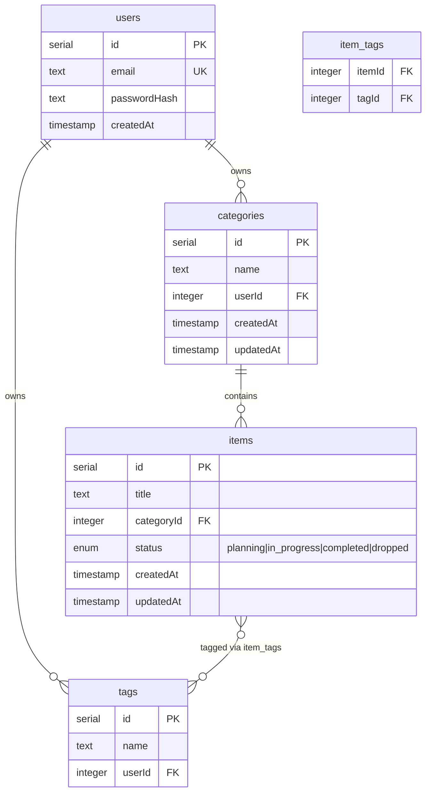

# AGENTS.md — Listing Tracker

Konteks proyek untuk AI coding agent. File ini selalu di-load — jaga tetap ringkas dan akurat, update begitu ada perubahan arsitektur.

## Tech Stack

- **Runtime**: Bun
- **Backend**: ElysiaJS (TypeScript) — **sudah selesai, jangan diubah tanpa alasan kuat**
- **Database**: PostgreSQL
- **ORM**: Drizzle ORM
- **Frontend**: React (Vite) — **ini yang sedang di-rebuild**
- **Styling**: Tailwind CSS v4 + shadcn/ui (komponen digenerate ke `src/components/ui/`, bukan npm dependency)
- **Data fetching**: Axios + TanStack Query
- **Routing**: React Router

## Perintah

```bash
# Backend
cd backend && bun dev          # jalankan dev server (port 3000)
cd backend && bun test         # jalankan test

# Frontend
cd frontend && bun dev         # jalankan dev server (port 5173, proxy /api -> :3000)
cd frontend && bun run build   # build production

# Database
cd backend && bunx drizzle-kit generate   # generate migration dari schema
cd backend && bunx drizzle-kit push       # apply ke database (development)
```

## Struktur Proyek

```
listing-tracker/
├── backend/          # SUDAH SELESAI — jangan modifikasi kecuali diminta eksplisit
│   └── src/
│       ├── db/                  # schema.ts, index.ts (koneksi Drizzle)
│       └── modules/
│           ├── auth/            # register, sign-in, sign-out, AuthGuard, rateLimiter
│           ├── category/        # CRUD kategori
│           ├── item/             # CRUD item + relasi tag
│           └── tag/               # CRUD tag
│
└── frontend/          # SEDANG DI-REBUILD — fokus kerja di sini
    └── src/
        ├── components/
        ├── hooks/
        ├── lib/           # axios.ts, api.ts
        ├── pages/
        └── types/
```

Setiap modul backend ikutin pola: `index.ts` (Elysia controller, routing saja) + `service.ts` (business logic, `abstract class` static methods) + `model.ts` (Elysia `t.Object` schema, single source of truth untuk validasi & tipe).

## Skema Database



## API Reference (Backend — Sudah Fixed, Frontend Konsumsi Ini)

Base URL dev: `/api` (proxy ke `localhost:3000`). Semua endpoint `categories`/`items`/`tags` butuh session cookie aktif (`isSignIn` guard) — request tanpa auth dapat `401`.

### Auth
| Method | Endpoint | Body | Response |
|---|---|---|---|
| POST | `/auth/register` | `{ email, password }` | `{ id, email }` |
| POST | `/auth/sign-in` | `{ email, password }` | `{ id, email }` (set session cookie) |
| POST | `/auth/sign-out` | — | `{ message }` |
| GET | `/auth/me` | — | `{ id, email }` (guarded) |

### Categories
| Method | Endpoint | Body | Response |
|---|---|---|---|
| GET | `/categories` | — | `Category[]` |
| GET | `/categories/:id` | — | `Category` \| 404 |
| POST | `/categories` | `{ name }` | `Category` \| 409 jika nama duplikat |
| PATCH | `/categories/:id` | `{ name }` | `Category` \| 404 |
| DELETE | `/categories/:id` | — | `Category` \| 404 (cascade hapus items) |
| GET | `/categories/:id/items` | query: `?search=&status=` | `Item[]` |

### Items
| Method | Endpoint | Body | Response |
|---|---|---|---|
| GET | `/items/:id` | — | `Item` \| 404 |
| POST | `/items` | `{ title, categoryId, status? }` | `Item` \| 400 jika categoryId invalid |
| PATCH | `/items/:id` | `{ title?, status? }` | `Item` \| 404 |
| DELETE | `/items/:id` | — | `Item` \| 404 |
| GET | `/items/:id/tags` | — | `Tag[]` |
| POST | `/items/:id/tags/:tagId` | — | `Tag[]` (semua tag item setelah attach) |
| DELETE | `/items/:id/tags/:tagId` | — | `Tag[]` (semua tag item setelah detach) |

### Tags
| Method | Endpoint | Body | Response |
|---|---|---|---|
| GET | `/tags` | — | `Tag[]` |
| POST | `/tags` | `{ name }` | `Tag` \| 409 jika nama duplikat |
| DELETE | `/tags/:id` | — | `Tag` \| 404 |

Item `status` enum: `planning` \| `in_progress` \| `completed` \| `dropped`.

Error response global (`onError`): `{ error: string, details?: string }` dengan status code sesuai (`422` validasi, `404` not found, `400` parse error, `409` conflict, `401` unauthorized, `429` rate limited, `500` default).

## Konvensi Frontend

- **Data fetching**: SELALU lewat TanStack Query (`useQuery`/`useMutation`), jangan `fetch`/`axios` langsung di component.
- **Query key**: array bertingkat sesuai resource — `['categories']`, `['items', categoryId, filters]`, `['items', itemId, 'tags']`, `['tags']`.
- **Mutasi**: selalu `invalidateQueries` pada `onSuccess`, bukan manual update state.
- **Struktur folder**: `components/` untuk UI reusable, `pages/` untuk 1 halaman utuh yang terhubung ke route, `hooks/` untuk logic data (query/mutation), `lib/` untuk axios instance & fungsi API mentah.
- **`axios.ts`**: instance dengan `withCredentials: true` (wajib untuk session cookie), response interceptor redirect ke `/login` saat 401.
- **Auth**: `useAuth()` hook, query `['auth', 'me']` dengan `retry: false`. `ProtectedRoute` component pakai nested route + `<Outlet />` untuk melindungi halaman.
- **Styling**: Tailwind utility classes + komponen shadcn/ui (`@/components/ui/*`) sebagai basis — jangan edit file di `ui/` langsung, bikin wrapper component untuk varian khusus. Lihat `design-system.md` untuk detail warna, komponen mana yang dipakai untuk kebutuhan apa, dan aturan kustomisasi.
- **Form**: uncontrolled minimal — `useState` per field, `preventDefault()`, reset setelah submit sukses.
- **Confirm delete**: aksi destruktif (delete category/item/tag) WAJIB lewat dialog konfirmasi, jangan langsung eksekusi dari klik tombol.

## Kesalahan yang Sering Terjadi (Update Bagian Ini Kalau Ada yang Baru)

- Jangan lupa `Number(params.id)` — React Router `useParams()` selalu return string.
- Query key harus include semua variabel yang mempengaruhi hasil (`filters`, `categoryId`) — kalau tidak, cache jadi stale/salah.
- Cookie `httpOnly` tidak bisa dibaca `document.cookie` di JS — status login harus dicek lewat `GET /auth/me`, bukan baca cookie manual.
